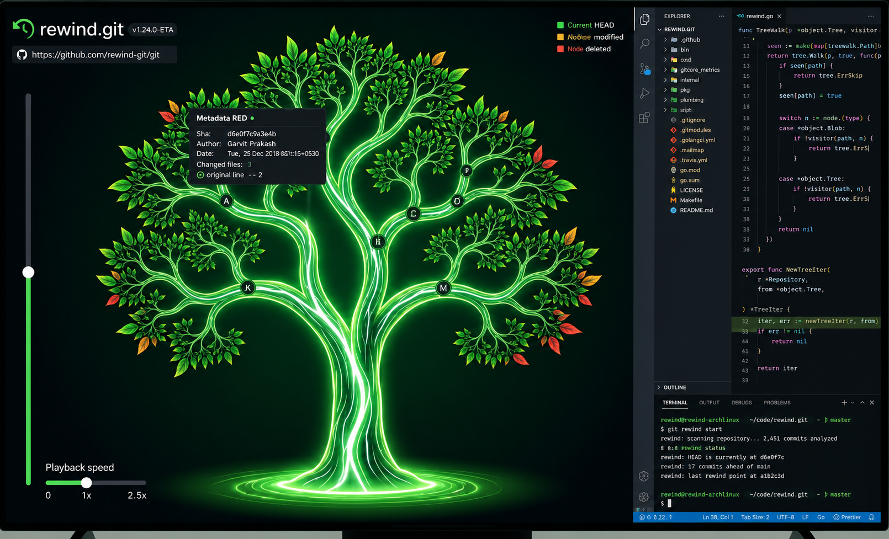
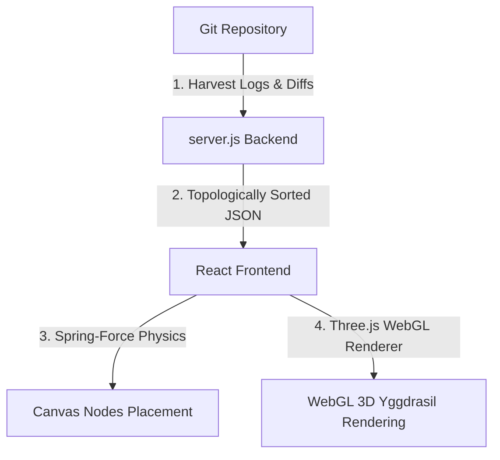

# rewind.git

## A project by Marvel fan 

> **Turn your Git history into a living, glowing Yggdrasil tree.**

**rewind.git** is an open-source, dark-mode developer tool that transforms any local or remote Git repository's commit history into an interactive, visually stunning canvas simulation. Branches grow as luminous botanical vines. Commits are glowing knots. File changes sprout as color-coded leaves. Traverse history, explore code trees, and audit diffs — all in real time.




---

## What's New

### v2.0.0 — Hyper-Realistic 3D WebGL Yggdrasil Tree (Latest)

- **3D WebGL Tree Visualizer (Three.js)** — Successfully upgraded the 2D HTML5 canvas to a full 3D interactive graphics simulation built with **Three.js**, incorporating advanced concepts from our local 3D skills repository.
- **Procedural Wood Bark & Foliage Materials** — Implemented physically-based rendering (PBR) materials with dynamically generated CanvasTextures. Branches are procedurally textured like real mossy forest bark (using custom bump map depth displacements), and foliage is generated using custom green leaf alpha-map masks.
- **Post-Processing Neon Bloom** — Integrated `EffectComposer`, `RenderPass`, and `UnrealBloomPass` to envelop active commit nodes and branch tips in a mystical, radiant electric glow.
- **Breathe-Animated Point Lights** — Placed dynamic `PointLight` instances inside every active commit node, casting pulsing glows on the surrounding bark and leaves.
- **Cinematic Camera Focus** — Smoothly interpolates the camera and OrbitControls focus target toward the active commit node as the timeline moves, creating a professional presentation feel.
- **Ethereal Fairy Dust System** — Added hundreds of glowing rising dust particles swirling around the Yggdrasil trunk and canopy to bring the 3D environment to life.
- **Ground Swirling Portal** — Concentric rings at the base of the trunk rotate in opposite directions, acting as the magical botanical gateway from which the tree sprouts.
- **Orbit Camera Controls** — Drag to rotate, pinch/scroll to zoom, and right-click to pan around the 3D Yggdrasil tree in real time.
- **Seamless Feature Preservation** — Retained compatibility with vector SVG downloads (via 2D projection) and WebM time-lapse video recording (via renderer `preserveDrawingBuffer` stream capture).

---

## Key Features

### Antigravity Node-Physics Simulation
An interactive HTML5 Canvas that structures branches as a force-directed spring network grown vertically like a tree. Drag to anchor nodes, scroll to zoom, and hover commit knots or leaves to view glassmorphic metadata HUDs.

### Yggdrasil Commit Tree
Commits form a living tree — the oldest commit is the root trunk; branches fork organically upward. Each branch is covered in fractal sub-branches and leaf clusters. File changes visible as glowing botanical leaves sprouting from each commit knot.

### VS Code-Style Workspace
Pixel-perfect VS Code layout alongside the canvas:
- **File Explorer Sidebar**: Folder expansions, file type icons, and `A`/`M`/`D` status badges.
- **Code Editor Pane**: Dark+ theme syntax highlighting, active tab selectors, and line numbers.
- **Line-by-Line Diffs**: Color-coded additions (green) and deletions (red).

### Integrated Git Terminal
A built-in bash-style terminal at the bottom of the editor. Outputs real-time Git statistics, author info, timestamps, and file change summaries as you scrub the timeline slider.

### Real-Time Harvester Engine
A local backend (`server.js`) that reads commit logs, authors, parent chains, and file structures. Supports:
- Local absolute directory paths
- Remote GitHub HTTPS URLs (shallow-cloned automatically)

### CLI Terminal Visualizer
`cli.js` renders a colorized ASCII branch graph of your commit history directly inside your terminal.

---

## Git Harvesting & Tree Representation



### 1. Data Harvesting (`server.js`)
To represent history dynamically, `rewind.git` harvests data straight from the shell:
* **Commit Graph & History extraction**: Spawns a child process executing `git log --pretty=format:"..." --name-status` to extract full commit lists, parent-child relationships, author tags, timestamps, and commit messages.
* **File-Level Diffs**: Executes `git show --name-status <commit_sha>` on demand to harvest added (`A`), modified (`M`), and deleted (`D`) file operations.
* **Transient Shallow Cloning**: For public GitHub HTTPS URLs, the server creates a fast, shallow clone (`git clone --bare --depth=...`) stored inside temporary project folders (`temp-clone-*`), building a lightweight, bare-cloned copy to speed up execution.

### 2. Graph & Tree Representation
* **Topological Spring-Force Layout**: Oldest commits are placed at the base, and youngest commits form the canopy. Faint attraction springs maintain the links between child and parent nodes, while node repulsion forces prevent branches and leaves from overlapping.
* **Multi-Pass Glowing Vines**: Connections are drawn as vertical Cubic Bezier curves with controlled midpoints. The rendering engine paints branches using three nested canvas layers:
  1. A wide **bloom layer** with alpha transparency for a soft neon glow.
  2. A solid **green bark layer** defining the core vine structure.
  3. A thin **white electric marrow line** running down the center.
* **Recursive Twig Generation**: 9 alternate sub-branch nodes are recursively calculated off the Bezier curve, with leaf nodes sprouting organic color-coded leaf blades matching change types (green=added, amber=modified, red=deleted).

---

## Architecture & Tech Stack

| Layer | Technology |
|---|---|
| **Frontend** | React + Vite, WebGL |
| **3D Rendering** | Three.js (OrbitControls, EffectComposer, UnrealBloomPass) |
| **Physics/Coord Engine** | Custom target-seeking coordinate generator |
| **Backend** | Node.js HTTP microservice (`server.js`, port `3001`) |
| **CLI** | Standalone Node.js with ANSI escape sequences |
| **Git Integration** | Native shell child processes (`git log`, `git clone`, `git show`) |

---

## Quick Start

### Prerequisites
- [Node.js](https://nodejs.org/) v16+
- [Git](https://git-scm.com/)

### Installation
```bash
git clone https://github.com/Garvit-821/rewind-git.git
cd rewind-git
npm install
```

### Running the Web Dashboard
```bash
# Terminal 1 — Start the backend harvester
node server.js

# Terminal 2 — Start the frontend dev server
npm run dev
```
Open **[http://localhost:5173](http://localhost:5173)**, then enter a local absolute path or a public GitHub HTTPS URL.

### Running the Terminal CLI Visualizer
```bash
node cli.js [path-to-git-repository]
```
*(Defaults to the current workspace if no path is provided.)*

---

## 🗺️ Future Roadmap

| Priority | Feature | Description |
|---|---|---|
| 🔥 **High** | **Contributor Branch Highlighting** | When a commit belongs to a specific contributor, that entire branch of the Yggdrasil tree glows in a distinct **electric blue** color. Hovering a contributor's name in a HUD highlights all their branches simultaneously across the whole tree. |
| ✅ **Completed** | **Hyper-Realistic Tree Rendering** | Upgraded to a 3D WebGL botanical tree with dynamic branch curves, bark textures, leaf clusters, wind sways, and glowing commit node light paths. |
| 🟡 **Medium** | **Branch Merge Visualization** | Render merge commits as two branches physically weaving together — vines coiling around each other before joining the trunk. |
| 🟡 **Medium** | **Commit Density Heatmap** | Color the trunk and branches by commit frequency — areas of rapid activity glow brighter yellow-white, while inactive periods dim to dark green. |
| 🟡 **Medium** | **Multi-Repo Forest Mode** | Visualize multiple repositories simultaneously as separate trees in the same forest canvas, connected at the ground by roots. |
| ✅ **Completed** | **3D Depth Projection** | Fully mapped 2D coordinate projections to true 3D spatial curve coordinates with interactive camera rotation and zoom. |
| ✅ **Completed** | **Export as SVG / Video** | Exporters for SVG vector files and WebM time-lapse video recordings are fully functional in the workspace. |
| 🟢 **Low** | **GitHub Actions Integration** | Show CI/CD run status per commit as leaf health — failing builds make leaves wilt (curl up, turn grey), passing builds make them bright and fully open. |
| ✅ **Completed** | **Auto Temp-Clone Cleanup Script** | A scheduled script (`server.js` process hook) that automatically deletes all `temp-clone-*` folders older than 24 hours on every server startup and midnight daily — preventing orphaned shallow clones from accumulating disk space. |

---

## License
This project is licensed under the **MIT License**.

---

<div align="center">
  <sub>Built by <a href="https://github.com/Garvit-821">Garvit Prakash</a> — rewind.git v1.0.0-BETA</sub>
</div>
