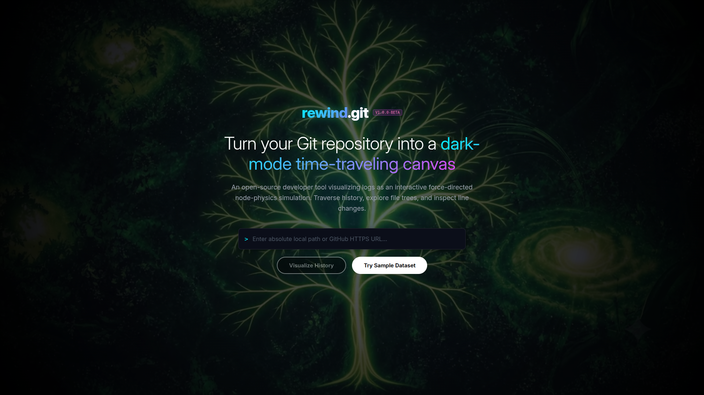
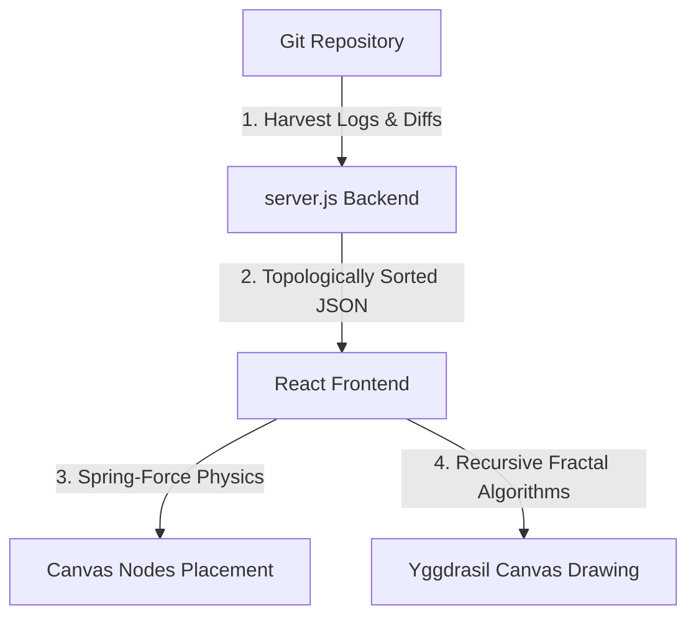

# rewind.git

## A project by Marvel fan 

> **Turn your Git history into a living, glowing Yggdrasil tree.**

**rewind.git** is an open-source, dark-mode developer tool that transforms any local or remote Git repository's commit history into an interactive, visually stunning canvas simulation. Branches grow as luminous botanical vines. Commits are glowing knots. File changes sprout as color-coded leaves. Traverse history, explore code trees, and audit diffs — all in real time.



---

## What's New

### v1.0.0-BETA — Yggdrasil Electric Tree (Latest)

- **Fractal Botanical Renderer** — The timeline canvas has been completely rewritten. Branches are now rendered as multi-pass glowing vines: a wide neon bloom layer, a solid green bark body, and a bright white electric core line — exactly like the luminous Yggdrasil tree of Norse mythology.
- **Recursive Fractal Sub-branches** — Along every Bezier limb, fractal sub-branches sprout at 9 sampled positions alternating left/right. Each sub-branch recursively generates depth-2 twig clusters with glowing leaf-tip dots, producing dense organic foliage.
- **Electric Trunk Base** — The root commit is anchored by a thick glowing trunk (36px bloom + 14px green bark + 3.5px white electric core) rising from a radial ground glow.
- **Color-Coded Change Leaves** — File changes per commit are rendered as pointed organic leaf blades sprouting upward from each node:
  - **Green** → Added files
  - **Amber** → Modified files
  - **Red** → Deleted files
- **Vertical Timeline Layout** — Commits now grow vertically upward from the base, with branches spreading symmetrically left (features) and right (hotfixes), forming a natural tree silhouette.
- **Cinematic Landing Video Background** — Integrated a beautiful high-fidelity glowing green cosmos loop (`bg.mp4`) as the background of the landing page.
- **Restart & Play Controls** — Added a `Restart & Play` button to instantly jump back to the first commit and auto-replay the history.
- **Playback Speed Adjuster** — A custom range slider allowing speed adjustments from `1x` (1500ms per commit) up to `20x` (75ms per commit) dynamically during replay.
- **Vector SVG Exporter** — Download a vector-based `.svg` file of the current Yggdrasil tree state, capturing the trunk, branches, recursive twigs, and change leaves in pixel-perfect scale.
- **Time-Lapse Video Recorder** — Capture and record a video (`.webm`) of your timeline growth dynamically using native HTML5 `captureStream` and `MediaRecorder` APIs. It automatically starts at commit 0 and stops recording at the final commit.
- **Leaf Hover HUD** — Hovering over any individual leaf reveals a floating glassmorphic card showing the exact file path, change type, commit SHA, and author.
- **Deep Forest Background** — Canvas background replaced with a near-pure-black radial gradient with subtle deep-green tones, matching the dark mystical aesthetic of the reference.
- **Physics Stabilization** — Reduced repulsion constants, added velocity cutoff thresholds, and increased damping to eliminate node vibration and jitter.
- **Stable Bezier Tree Limbs** — Branch connections are now drawn as smooth vertical S-curves (Bezier with midpoint control), with tapered thickness that reduces toward the canopy twigs.

---

## Key Features

### Antigravity Node-Physics Simulation
An interactive HTML5 Canvas that structures branches as a force-directed spring network grown vertically like a tree. Drag to anchor nodes, scroll to zoom, and hover commit knots or leaves to view glassmorphic metadata HUDs.

### Yggdrasil Commit Tree
Commits form a living tree — the oldest commit is the root trunk; branches fork organically upward. Each branch is covered in fractal sub-branches and leaf clusters. File changes visible as glowing botanical leaves sprouting from each commit knot.

### VS Code-Style Workspace
Pixel-perfect VS Code layout alongside the canvas:
- **File Explorer Sidebar**: Folder expansions, file type icons, and `A`/`M`/`D` status badges.
- **Code Editor Pane**: Dark+ theme syntax highlighting, active tab selectors, and line numbers.
- **Line-by-Line Diffs**: Color-coded additions (green) and deletions (red).

### Integrated Git Terminal
A built-in bash-style terminal at the bottom of the editor. Outputs real-time Git statistics, author info, timestamps, and file change summaries as you scrub the timeline slider.

### Real-Time Harvester Engine
A local backend (`server.js`) that reads commit logs, authors, parent chains, and file structures. Supports:
- Local absolute directory paths
- Remote GitHub HTTPS URLs (shallow-cloned automatically)

### CLI Terminal Visualizer
`cli.js` renders a colorized ASCII branch graph of your commit history directly inside your terminal.

---

## Git Harvesting & Tree Representation



### 1. Data Harvesting (`server.js`)
To represent history dynamically, `rewind.git` harvests data straight from the shell:
* **Commit Graph & History extraction**: Spawns a child process executing `git log --pretty=format:"..." --name-status` to extract full commit lists, parent-child relationships, author tags, timestamps, and commit messages.
* **File-Level Diffs**: Executes `git show --name-status <commit_sha>` on demand to harvest added (`A`), modified (`M`), and deleted (`D`) file operations.
* **Transient Shallow Cloning**: For public GitHub HTTPS URLs, the server creates a fast, shallow clone (`git clone --bare --depth=...`) stored inside temporary project folders (`temp-clone-*`), building a lightweight, bare-cloned copy to speed up execution.

### 2. Graph & Tree Representation
* **Topological Spring-Force Layout**: Oldest commits are placed at the base, and youngest commits form the canopy. Faint attraction springs maintain the links between child and parent nodes, while node repulsion forces prevent branches and leaves from overlapping.
* **Multi-Pass Glowing Vines**: Connections are drawn as vertical Cubic Bezier curves with controlled midpoints. The rendering engine paints branches using three nested canvas layers:
  1. A wide **bloom layer** with alpha transparency for a soft neon glow.
  2. A solid **green bark layer** defining the core vine structure.
  3. A thin **white electric marrow line** running down the center.
* **Recursive Twig Generation**: 9 alternate sub-branch nodes are recursively calculated off the Bezier curve, with leaf nodes sprouting organic color-coded leaf blades matching change types (green=added, amber=modified, red=deleted).

---

## Architecture & Tech Stack

| Layer | Technology |
|---|---|
| **Frontend** | React + Vite, HTML5 Canvas 2D |
| **Physics Engine** | Custom force-directed spring layout (no library) |
| **Renderer** | Fractal canvas painter (multi-pass bloom + green bark + white core) |
| **Backend** | Node.js HTTP microservice (`server.js`, port `3001`) |
| **CLI** | Standalone Node.js with ANSI escape sequences |
| **Git Integration** | Native shell child processes (`git log`, `git clone`, `git show`) |

---

## Quick Start

### Prerequisites
- [Node.js](https://nodejs.org/) v16+
- [Git](https://git-scm.com/)

### Installation
```bash
git clone https://github.com/Garvit-821/rewind-git.git
cd rewind-git
npm install
```

### Running the Web Dashboard
```bash
# Terminal 1 — Start the backend harvester
node server.js

# Terminal 2 — Start the frontend dev server
npm run dev
```
Open **[http://localhost:5173](http://localhost:5173)**, then enter a local absolute path or a public GitHub HTTPS URL.

### Running the Terminal CLI Visualizer
```bash
node cli.js [path-to-git-repository]
```
*(Defaults to the current workspace if no path is provided.)*

---

## 🗺️ Future Roadmap

| Priority | Feature | Description |
|---|---|---|
| 🔥 **High** | **Contributor Branch Highlighting** | When a commit belongs to a specific contributor, that entire branch of the Yggdrasil tree glows in a distinct **electric blue** color. Hovering a contributor's name in a HUD highlights all their branches simultaneously across the whole tree. |
| 🔥 **High** **[ONGOING]**| **Hyper-Realistic Tree Rendering** | Increase fractal twig recursion depth to 4–5 levels, add wind-sway micro-animation along branch tips, and use parametric bark textures to make the tree feel like a true living organism rather than a glowing graph. |
| 🟡 **Medium** | **Branch Merge Visualization** | Render merge commits as two branches physically weaving together — vines coiling around each other before joining the trunk. |
| 🟡 **Medium** | **Commit Density Heatmap** | Color the trunk and branches by commit frequency — areas of rapid activity glow brighter yellow-white, while inactive periods dim to dark green. |
| 🟡 **Medium** | **Multi-Repo Forest Mode** | Visualize multiple repositories simultaneously as separate trees in the same forest canvas, connected at the ground by roots. |
| 🟢 **Low** | **3D Depth Projection** | Add a subtle isometric z-depth to branches so the tree appears to grow in 3D space, with closer branches appearing larger. |
| ✅ **Completed** | **Export as SVG / Video** | Exporters for SVG vector files and WebM time-lapse video recordings are fully functional in the workspace. |
| 🟢 **Low** | **GitHub Actions Integration** | Show CI/CD run status per commit as leaf health — failing builds make leaves wilt (curl up, turn grey), passing builds make them bright and fully open. |
| ✅ **Completed** | **Auto Temp-Clone Cleanup Script** | A scheduled script (`server.js` process hook) that automatically deletes all `temp-clone-*` folders older than 24 hours on every server startup and midnight daily — preventing orphaned shallow clones from accumulating disk space. |

---

## License
This project is licensed under the **MIT License**.

---

<div align="center">
  <sub>Built by <a href="https://github.com/Garvit-821">Garvit Prakash</a> — rewind.git v1.0.0-BETA</sub>
</div>
